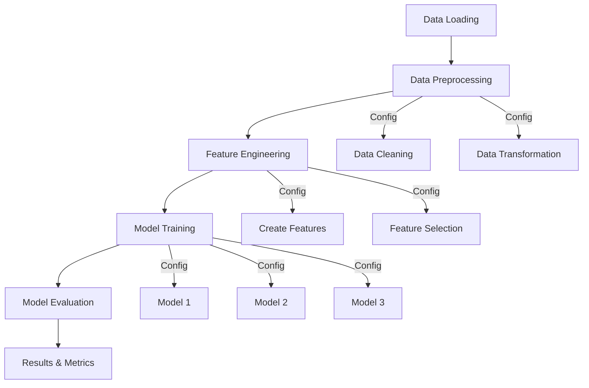

# Hotel No-Show Prediction Project

## Requirements Specification Document (RSD)

### Project Objective
To predict customer no-shows for a hotel chain and help formulate policies to reduce expenses incurred due to no-shows through data analysis and machine learning models.

### Tasks and Requirements

#### 1. Exploratory Data Analysis (EDA)
- **Deliverable**: Interactive Python notebook (`eda.ipynb`)
- **Requirements**:
  - Document clear steps in the EDA process
  - Explain purpose and rationale of each analysis step
  - Draw and document conclusions from each analysis
  - Interpret statistical results and their implications
  - Create clear, meaningful visualizations
  - Support findings with visual evidence
  - Organize notebook for clarity and understanding
  - Provide comprehensive documentation

#### 2. Machine Learning Pipeline
- **Deliverable**: End-to-end ML solution
- **Requirements**:
  - Implement at least 3 different prediction models
  - Evaluate and compare model performances
  - Document model selection rationale
  - Provide implementation details
  - Include feature engineering process
  - Detail model optimization steps
  - Compare and analyze results

### Evaluation Criteria
- Code quality and organization
- Analysis depth and thoroughness
- Documentation clarity
- Visualization effectiveness
- Model performance metrics
- Implementation completeness

## Personal Information
- **Full Name**: [Your Full Name as in NRIC]
- **Email**: [Your Application Email]

## Project Overview
This project develops a machine learning solution for predicting customer no-shows for a hotel chain. The goal is to help the hotel chain reduce expenses incurred due to customer no-shows through predictive modeling and data analysis.

## Objectives
1. **Exploratory Data Analysis (EDA)**
   - Analyze patterns in customer booking behavior
   - Identify key factors influencing no-shows
   - Visualize relationships between various features
   - Provide insights for policy recommendations

2. **Machine Learning Pipeline**
   - Develop an end-to-end ML pipeline
   - Evaluate at least 3 different prediction models
   - Compare model performances
   - Select the best performing model for deployment

## Project Structure
```
hotel_noshow/
├── notebooks/
│   └── eda.ipynb              # Exploratory Data Analysis notebook
├── src/
│   ├── __init__.py           # Makes src a Python package
│   ├── config.py             # Configuration management
│   ├── data/
│   │   ├── __init__.py
│   │   ├── loader.py         # Data loading from SQLite
│   │   └── preprocessor.py   # Data preprocessing
│   ├── features/
│   │   ├── __init__.py
│   │   └── engineer.py       # Feature engineering
│   ├── models/
│   │   ├── __init__.py
│   │   ├── trainer.py        # Model training
│   │   └── evaluator.py      # Model evaluation
│   └── utils/
│       ├── __init__.py
│       └── helpers.py        # Utility functions
├── config/
│   └── params.yaml           # Model and preprocessing parameters
├── requirements.txt          # Project dependencies
├── run.sh                    # Execution script
└── README.md                 # Project documentation

## Setup and Installation
1. Clone this repository
2. Create and activate the virtual environment:
   ```
   python -m venv noshow_env
   .\noshow_env\Scripts\activate  # On Windows
   ```
3. Install required dependencies:
   ```
   pip install -r requirements.txt
   ```

## Pipeline Design and Implementation

### Pipeline Logical Flow


### Feature Processing Summary

| Feature | Type | Processing | Engineering | Rationale |
|---------|------|------------|-------------|-----------|
| [Feature 1] | [Numeric/Categorical] | [Processing steps] | [Engineering applied] | [Reason] |
| [Feature 2] | [Numeric/Categorical] | [Processing steps] | [Engineering applied] | [Reason] |
| ... | ... | ... | ... | ... |

### Key EDA Findings and Pipeline Decisions
1. **Finding 1**
   - Observation: [Description]
   - Implementation: [How it affected pipeline design]

2. **Finding 2**
   - Observation: [Description]
   - Implementation: [How it affected pipeline design]

[Additional findings...]

### Model Selection and Rationale

1. **Model 1**: [Model Name]
   - Reason for selection: [Explanation]
   - Expected advantages: [List advantages]
   - Potential limitations: [List limitations]

2. **Model 2**: [Model Name]
   - Reason for selection: [Explanation]
   - Expected advantages: [List advantages]
   - Potential limitations: [List limitations]

3. **Model 3**: [Model Name]
   - Reason for selection: [Explanation]
   - Expected advantages: [List advantages]
   - Potential limitations: [List limitations]

### Model Evaluation

#### Metrics Used
1. **Metric 1**
   - Description: [Explain metric]
   - Rationale: [Why this metric is relevant]

2. **Metric 2**
   - Description: [Explain metric]
   - Rationale: [Why this metric is relevant]

#### Results Summary
| Model | Metric 1 | Metric 2 | Metric 3 |
|-------|----------|----------|----------|
| Model 1 | [Score] | [Score] | [Score] |
| Model 2 | [Score] | [Score] | [Score] |
| Model 3 | [Score] | [Score] | [Score] |

## Implementation Details

### 1. Exploratory Data Analysis
- Located in `notebooks/eda.ipynb`
- Includes data cleaning and preprocessing
- Feature analysis and visualization
- Statistical analysis of no-show patterns
- Correlation analysis between features

### 2. Machine Learning Pipeline
- Data preprocessing and feature engineering
- Model selection and training
- Model evaluation and comparison
- Cross-validation and hyperparameter tuning
- Performance metrics analysis

### 3. Models Evaluated
- Model 1 (TBD)
- Model 2 (TBD)
- Model 3 (TBD)

## Usage and Execution Instructions

### Running the Pipeline
1. Ensure you're in the project root directory
2. Make the run script executable (Unix/Linux):
   ```bash
   chmod +x run.sh
   ```
3. Execute the pipeline:
   ```bash
   ./run.sh
   ```

### Modifying Parameters
The pipeline can be configured through:

1. **Configuration File** (`config/params.yaml`):
   ```yaml
   preprocessing:
     scaling: standard  # or minmax, robust
     handling_missing: mean  # or median, mode
   
   feature_engineering:
     create_interactions: true
     polynomial_degree: 2
   
   model:
     type: randomforest  # or xgboost, lightgbm
     parameters:
       n_estimators: 100
       max_depth: 10
   ```

2. **Environment Variables**:
   ```bash
   export MODEL_TYPE=randomforest
   export N_ESTIMATORS=100
   ```

3. **Command Line Arguments**:
   ```bash
   ./run.sh --model randomforest --n-estimators 100
   ```

### Running EDA Notebook
1. Activate the virtual environment:
   ```
   .\noshow_env\Scripts\activate  # On Windows
   ```
2. Launch Jupyter notebook:
   ```
   jupyter notebook notebooks/eda.ipynb
   ```

## Expected Outcomes
- Comprehensive data analysis report
- Trained machine learning models
- Model performance comparisons
- Recommendations for policy changes
- Prediction system for future bookings

## Virtual Environment
The project uses a Python virtual environment (`noshow_env`) to manage dependencies and ensure reproducibility.

## Requirements
See `requirements.txt` for a list of Python package dependencies.

## License
This project is proprietary and confidential.

## Contributing
This is an assessment project and is not open for contributions.