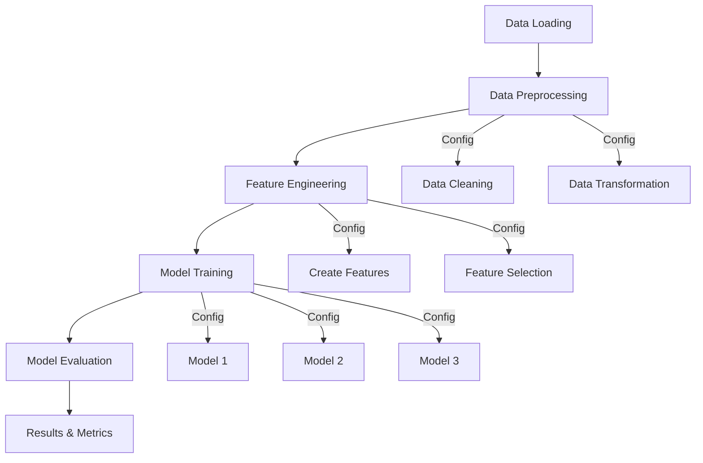

# Hotel No-Show Prediction Project

[](https://github.com/StephenKingWongSengKwong/AIAP-Technical-Assessment-Past-Years-Series/commit/8f9cedb)

## Requirements Specification Document (RSD)

### Project Objective
To predict customer no-shows for a hotel chain and help formulate policies to reduce expenses incurred due to no-shows through data analysis and machine learning models.

### Tasks and Requirements

#### 1. Exploratory Data Analysis (EDA)
- **Deliverable**: Interactive Python notebook (`eda.ipynb`)
- **Requirements**:
  - Document clear steps in the EDA process
  - Explain purpose and rationale of each analysis step
  - Draw and document conclusions from each analysis
  - Interpret statistical results and their implications
  - Create clear, meaningful visualizations
  - Support findings with visual evidence
  - Organize notebook for clarity and understanding
  - Provide comprehensive documentation

#### 2. Machine Learning Pipeline
- **Deliverable**: End-to-end ML solution
- **Requirements**:
  - Implement at least 3 different prediction models
  - Evaluate and compare model performances
  - Document model selection rationale
  - Provide implementation details
  - Include feature engineering process
  - Detail model optimization steps
  - Compare and analyze results

### Evaluation Criteria
- Code quality and organization
- Analysis depth and thoroughness
- Documentation clarity
- Visualization effectiveness
- Model performance metrics
- Implementation completeness

## Personal Information
- **Full Name**: [Your Full Name as in NRIC]
- **Email**: [Your Application Email]

## Project Overview
This project develops a machine learning solution for predicting customer no-shows for a hotel chain. The goal is to help the hotel chain reduce expenses incurred due to customer no-shows through predictive modeling and data analysis.

## Objectives
1. **Exploratory Data Analysis (EDA)**
   - Analyze patterns in customer booking behavior
   - Identify key factors influencing no-shows
   - Visualize relationships between various features
   - Provide insights for policy recommendations

2. **Machine Learning Pipeline**
   - Develop an end-to-end ML pipeline
   - Evaluate at least 3 different prediction models
   - Compare model performances
   - Select the best performing model for deployment

## Project Structure
```
hotel_noshow/
├── notebooks/
│   └── eda.ipynb              # Exploratory Data Analysis notebook
├── src/
│   ├── __init__.py           # Makes src a Python package
│   ├── config.py             # Configuration management
│   ├── data/
│   │   ├── __init__.py
│   │   ├── loader.py         # Data loading from SQLite
│   │   └── preprocessor.py   # Data preprocessing
│   ├── features/
│   │   ├── __init__.py
│   │   └── engineer.py       # Feature engineering
│   ├── models/
│   │   ├── __init__.py
│   │   ├── trainer.py        # Model training
│   │   └── evaluator.py      # Model evaluation
│   └── utils/
│       ├── __init__.py
│       └── helpers.py        # Utility functions
├── config/
│   └── params.yaml           # Model and preprocessing parameters
├── requirements.txt          # Project dependencies
├── run.sh                    # Execution script
└── README.md                 # Project documentation

## Setup and Installation
1. Clone this repository
2. Create and activate the virtual environment:
   ```
   python -m venv noshow_env
   .\noshow_env\Scripts\activate  # On Windows
   ```
3. Install required dependencies:
   ```
   pip install -r requirements.txt
   ```

## Pipeline Design and Implementation

### Pipeline Logical Flow


### Feature Processing Summary

| Feature | Type | Processing | Engineering | Rationale |
|---------|------|------------|-------------|-----------|
| [Feature 1] | [Numeric/Categorical] | [Processing steps] | [Engineering applied] | [Reason] |
| [Feature 2] | [Numeric/Categorical] | [Processing steps] | [Engineering applied] | [Reason] |
| ... | ... | ... | ... | ... |

### Key EDA Findings and Pipeline Decisions
1. **Finding 1**
   - Observation: [Description]
   - Implementation: [How it affected pipeline design]

2. **Finding 2**
   - Observation: [Description]
   - Implementation: [How it affected pipeline design]

[Additional findings...]

### Model Selection and Rationale

1. **Model 1**: [Model Name]
   - Reason for selection: [Explanation]
   - Expected advantages: [List advantages]
   - Potential limitations: [List limitations]

2. **Model 2**: [Model Name]
   - Reason for selection: [Explanation]
   - Expected advantages: [List advantages]
   - Potential limitations: [List limitations]

3. **Model 3**: [Model Name]
   - Reason for selection: [Explanation]
   - Expected advantages: [List advantages]
   - Potential limitations: [List limitations]

### Model Evaluation

#### Metrics Used
1. **Metric 1**
   - Description: [Explain metric]
   - Rationale: [Why this metric is relevant]

2. **Metric 2**
   - Description: [Explain metric]
   - Rationale: [Why this metric is relevant]

#### Results Summary
| Model | Metric 1 | Metric 2 | Metric 3 |
|-------|----------|----------|----------|
| Model 1 | [Score] | [Score] | [Score] |
| Model 2 | [Score] | [Score] | [Score] |
| Model 3 | [Score] | [Score] | [Score] |

## Implementation Details

### 1. Exploratory Data Analysis
- Located in `notebooks/eda.ipynb`
- Includes data cleaning and preprocessing
- Feature analysis and visualization
- Statistical analysis of no-show patterns
- Correlation analysis between features

### 2. Machine Learning Pipeline
- Data preprocessing and feature engineering
- Model selection and training
- Model evaluation and comparison
- Cross-validation and hyperparameter tuning
- Performance metrics analysis

### 3. Models Evaluated
- Model 1 (TBD)
- Model 2 (TBD)
- Model 3 (TBD)

## Usage and Execution Instructions

Below are precise instructions for running the pipeline locally, configuring experiments, and where to find outputs.

### 1) Prepare your environment (Windows PowerShell)
1. Create & activate virtual environment (one-time):
   ```powershell
   python -m venv .venv
   .\.venv\Scripts\Activate.ps1
   ```
2. Install dependencies (one-time):
   ```powershell
   pip install -r requirements.txt
   ```

### 2) Configure the pipeline
- Primary config file: `config/params.yaml`. Edit these keys as needed:
  - `database_path`: path to your SQLite DB (e.g. `data/hotel_data.db`)
  - `data_query`: SQL query to fetch the data (e.g. `SELECT * FROM bookings`)
  - `target_column`: name of the label column (default `no_show`)
  - `model_type`: `randomforest`, `xgboost`, or `lightgbm`
  - `model_params`: dictionary of model hyperparameters
  - `test_size`, `random_state`, `cv_folds`, `scoring`, `model_dir`

- You can also override config values using environment variables. Examples (PowerShell):
  ```powershell
  $env:MODEL_TYPE = "xgboost"
  $env:TEST_SIZE = "0.25"
  ```

### 3) Run the pipeline
- Via Python (recommended on Windows PowerShell):
  ```powershell
  python src/main.py --config config/params.yaml
  ```

- Via `run.sh` (Unix-like shells / Git Bash / WSL):
  ```bash
  chmod +x run.sh
  ./run.sh
  ```

### 4) Quick experiment patterns
- Change the model quickly (env var):
  ```powershell
  $env:MODEL_TYPE = "lightgbm"
  python src/main.py --config config/params.yaml
  ```
- Run with a different config file:
  ```powershell
  python src/main.py --config config/params_experiment.yaml
  ```

### 5) Running the EDA notebook
1. Activate your venv (see above).
2. Open Jupyter Notebook (PowerShell):
   ```powershell
   jupyter notebook notebooks/eda.ipynb
   ```

If you use JupyterLab, you can open the notebook there as well.

## Outputs and Artifacts
- Trained models: saved in the path defined by `model_dir` in `config/params.yaml` (default `models/`) as `{model_type}_model.joblib`.
- Metrics & logs: printed to console (logger). You can redirect output to a file to capture metrics, or extend `src/main.py` to save metrics to `models/metrics.json` or CSV.
- Intermediate files (optional): you can extend the pipeline to save preprocessed datasets, feature importances, or model checkpoints.

## Troubleshooting
- Database errors: if `DataLoader` can't open the DB, ensure `config/params.yaml` → `database_path` points to an existing `.db` file and the `data_query` matches your schema. Use a SQLite browser to inspect tables.
- Missing packages: if you see `ModuleNotFoundError` for `xgboost` or `lightgbm`, install them via pip (these are optional unless you select those models):
   ```powershell
   pip install xgboost lightgbm
   ```
- run.sh on Windows: either use Git Bash / WSL or call `python src/main.py` directly from PowerShell.
- Column/Type mismatches: If preprocessing fails, print `df.dtypes` early in `src/main.py` or adjust `data_query` so columns have expected types. Update `config/params.yaml` `target_column` if needed.

## Next Steps & Improvements
- Persist metrics to `models/metrics/` as JSON/CSV for experiment tracking.
- Add GridSearchCV/RandomizedSearchCV for hyperparameter tuning.
- Add a simple unit test suite for `DataLoader` and `Preprocessor`.
- Add CI to run linting and tests on each push.

## Virtual Environment
The project uses a Python virtual environment (`noshow_env`) to manage dependencies and ensure reproducibility.

## Requirements
See `requirements.txt` for a list of Python package dependencies.

## License
This project is proprietary and confidential.

## Contributing
This is an assessment project and is not open for contributions.